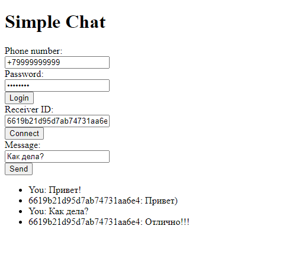
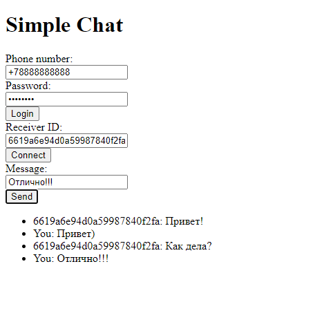

# SimpleMessenger

## Тестовое задание на позицию Python Developer 

## Техническое задание
Ваша задача - написать RESTful API простого мессенджера.
Реализуемый функционал:
- Механизм авторизации
- Поиск пользователей
- Возможность отправлять личные сообщения
- Настройки пользователя (username, аватар, номер телефона, т.п.)

Для реализации используйте FastAPI и MongoDB.


## Используемый стек
- Python 3.12
- FastAPI
- MongoDB
- Motor
- WebSockets


## Начало работы
Для локального запуска SimpleMessenger выполните следующие шаги:

1. Клонирование репозитория и установка зависимостей:
    ```bash
    git clone git@github.com:qwertttyyy/SimpleMessenger.git
    cd SimpleMessenger
    pip install -r requirements.txt
    ```
2. Создайте файл .env 
    ```dotenv
   APP_TITLE=SimpleMessanger
   DATABASE_URL=mongodb://localhost:27017   # url адрес MongoDB сервера
   DATABASE_NAME=db                         # Имя базы данных
   SECRET=SECRET                            # Секретный ключ для шифрования
   JWT_LIFETIME_SECONDS=3600                # Кол-во секнуду жизни JWT токена
   ```

2. Для работы проекта должен быть запущен MongoDB сервер. <br>
Укажите url сервера в файле .env, если он отличный от дефолтного

3. Запуск сервера FastAPI:
    ```bash
    uvicorn main:app --reload
    ```

5. #### Приложение будет доступно по адресу http://127.0.0.1:8000
   #### Swagger документация http://127.0.0.1:8000/docs

## Основной функционал:
1. Регистрация пользователей <br>
Пользователь может зарегистрироваться по номеру телефона и паролю.<br>
Клиент отправляет запрос на эндпоинт `/auth/register`
2. Авторизация <br>
Пользователь может авторизоваться по номеру телефона и паролю.<br>
Клиент отправляет запрос на эндпоинт `/auth/login`
3. Настройки <br>
Пользователь может добавить/изменить юзернейм, почту и информацию о себе. <br>
Клиент отправляет запрос на `/users/me`.
Пользователь может добавить аватар можно послав в теле запроса файл изображения на ```/users/avatar```
4. Поиск пользователей <br>
Пользователь может искать других пользователей по номеру телефона, юзернейму или почте.
Клиент отправляет запрос на /users/` с соответствующими query-параметрами
5. Отправлять личные сообщения
Пользователь может отправлять личные сообщения другим пользователям.
Сервер может соединять двух клиентов устанавливая связь через два вебсокет соединения используя id пользователей.
Клиент авторизуется и может обратиться на `/ws/{receiver_id}/{token}`
   - `receiver_id` - ID получателя сообщений
   - `token` - JWT токен аутентифицированного пользователя <br>
   Если токен валидный, устанавливается соединение. <br><br>
   Отправленные сообщения сохраняются в базу. Их можно получить отправив запрос на `/messages/{receiver_id}`
   
### Реализована страница чата с демонстрацией работы:

 

Чтобы воспользоваться нужно:
1. Перейти на страницу `/chat`
2. Ввести телефон и пароль пользователя, нажать Login.
3. Ввести ID получателя, нажать Connect
4. Повторить 1 - 3 пункт на другой странице с другим 
5. Ввести сообщение, нажать send

